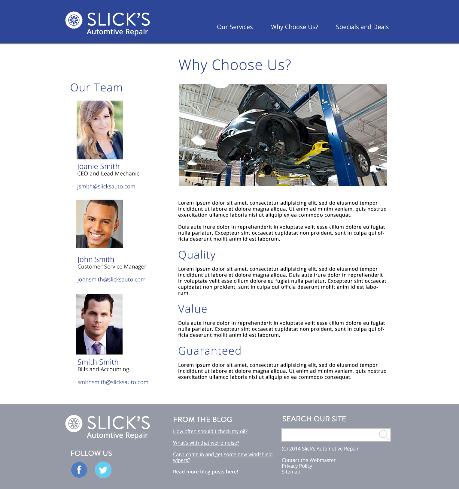

## Table of Contents

* [Setting Up Version Control](#setting-up-version-control)
	* Walkthrough of Github
	* Setting up a Github Project
* [Creating a Blank Template](#creating-a-blank-template)
* [Class Presentations](#class-presentations)
* [Creating a Blog Site](#creating-a-blog-site)
* [Creating a Business Site](#creating-a-business-site)
* [In-Class Critiques](#in-class-critiques)

## <a name="setting-up-version-control" style="color: #666">Setting Up Version Control</a>

Hopefully you all have some experience with some sort of version control up to this point. Not only is version control good for project management generally, it also lets others see your code and potentially help you if you are having an issue. For this course, version control will be key in 1) letting me see your code, 2) letting me see your progress, 3) learning best practices for web development, and 4) letting me or others help you if you are having trouble. 

There are a lot of different version control solutions of varying quality and features. Depending on your comfort with command line, server setup, and financial resources you will want to choose a version control system that best suits your development environment. A VC (Version Control) system should be chosen based on numerous factors other than how technical you are or how much you can afford, but it mostly deals with the organization (how many people and their expertise) and how secure you want your content to be. For this class, it is required that you use Github for your projects.

###  Walkthrough of Github

The version control mechanism we are going to use for this course is Github. Since we are going to want a VC that is publicly available, free, and easy to use I have chosen Github. I apologize in advance if there are slight differences between a Mac Github experience and a Windows/Linux experience. 

#### Step One: Create a Github Account and Log in

From here we will poke around through the website and see where everything is located and what it does. I highly suggest you work through the Github Bootcamp tutorials that are available once you log in. 

#### Step Two: Get to Know Git

Here is some terminology that you should know going into this:

**[Github Glossary](https://help.github.com/articles/github-glossary/)**

**Git**: Git is just one method of version control of many. It has become the most popular method for implementing version control, though others exist and are still widely used. 

**Commit**: "A commit, or "revision", is an individual change to a file (or set of files)." Commits are the basis of version control because they allow you to identify changes to your project in a step-by-step approach. 

**Push**: "Pushing refers to sending your committed changes to a remote repository"

**Pull**: "Pull refers to when you are fetching in changes and merging them."

**Fork/Branch**: "A branch is a parallel version of a repository." Branches allow you to modify another repository without having to modify the master. A Fork is similar to this, except the copy of the repository lives on your account. The difference, in practice, is generally that a branch will eventually be merged into the master if it is needed while a fork will be kept on your account (though many people make push/pull requests if the forked repository fixes something). 

**Readme**: A Readme file contains descriptive information about the project. It is often an "md" file which stands for Markdown. Markdown is a simplified templating language which makes organizing the descriptive information easy.

###  Setting up a Github Project

Luckily, GitHub has a good introduction section after you log in. Follow along with the "GitHub Bootcamp"  to set up a place for our blank template. 

We are going to follow along and set up a new repository titled "WIE-Blank-Template" or something like that...

## <a name="creating-a-blank-template">Creating a Blank Template</a>

Many of the tutorials in this book will lead you to be able to create a complete blank template. When you finish these tutorials, you will package the files and submit them to me (on Github).  

This will be the basis for the other WordPress projects in class. This project should be submitted as a single zipped file with the following naming convention:

	firstname-lastname-WIE-template.zip

The steps below outline the process in greater detail.

	MAKE SURE YOU SAVE THESE FILES IN A SEPARATE FILE SO THAT YOU HAVE THE BLANK TEMPLATE FOR FUTURE PROJECTS WITHOUT MODIFICATIONS!

### Project Requirements:

1. Create a folder title "blank-template-yourname"

2. Create the following files and place them in your template folder:
	* Index.php
	* Header.php
	* Footer.php
	* Functions.php
	* Page.php
	* Single.php
	* 404.php
	* Archive.php
	* Search.php
	* Sidebar.php
	* Style.css

3. Follow along in class to make sure these files all work together.

4. When you have created these files and the class has progressed to the end of this series of lectures, *email your github respository to me* or email the files to me zipped. (Github preferred)

5. Make sure you keep a separate zipped copy of these files separate from the "Modify a Wordpress Template" files so that you can reuse these files for your final project.

### Using These Course Materials

Completion of this project can be done by following along with the following tutorials:

#### Chapter 3:
* Tutorial: Creating a WordPress Template
* Tutorial: Enabling the Blank Template
* Linking to Files in a Template
* Tutorial: Implementing a Grid System
* Tutorial: Header and Footer
* Tutorial: Adding the Loop
* Tutorial: Pages Template
* Tutorial: Posts Template
* Tutorial: Sidebars Includes

#### Chapter 4: 
* Tutorial: Adding Widgets
* Tutorial: Adding Multiple Widgets
* Tutorial: Adding a Dynamic Menu
* Tutorial: Creating an Archive Page
* Tutorial: Creating a Search Page
* Tutorial: Creating a 404 Page
* Tutorial: Adding Featured Images and Thumbnails to Theme

## <a name="class-presentations">Class Presentations</a>

	This project is very specific to the Web Interactivity and Engagement Course - if you are using this course book for your general knowledge, disregard this section.

You will be assigned a different "element" of web development as outlined in the ["Elements of a Website" lecture](http://jayres.github.io/Web-Interactivity-and-Engagement/chapter-2/#elements) here: [http://jayres.github.io/Web-Interactivity-and-Engagement/chapter-2/#elements](http://jayres.github.io/Web-Interactivity-and-Engagement/chapter-2/#elements)

This project is intended to bring a more academic understanding of a fundamental idea of web development through a specific topic that will be instructive to both you and the other members of the course. 

You will create a twenty minute presentation as an entry point to a weekly topic. The expectation will be 20 minutes to 25 minutes of instruction, shared resources about a topic, and a paper to be submitted by the end of the semester.

#### Below are the steps and specifications:

1. Research: Research the sub-topic. For the final paper submission, you must include at least 5 sources.

2. Create and Present 20ish Minutes: Include a powerpoint or some visual and have interactivity (questions, etc.) for the rest of the class.

3. Submit paper or make blog post about the topic: Minimum 500 word discussion of the sub-topic including citation of the sources (no standard for citations – just URLs, title of the post, and author).

#### Topics to Choose From:

You must craft your own sub-topic under one of these major topics that will be assigned to you:

1. Environmental
2. Aesthetics
3. Story
4. Usability
5. Performance

The sub-topic must be approved by the professor (not for quality, but to ensure that there aren’t two of the same presentations). 

Email him with your sub-topic and await approval before beginning.

#### Dates to Present

You must present your project on one of the allowable dates. No more than two people may present on a single day. When I assign this in class I will give you a list of allowable dates.

## <a name="creating-a-blog-site" style="color: #666">Creating a Blog Site</a>

You will mock up and then implement changes to the WordPress template to make a functioning blog and to suit your particular project needs. The site you are modifying will be the same site you are completing your "Post and Plugins" project on.

1. Create two mock ups and wireframes of a design for your blog. These design may take inspiration from any source, but must contain significant and exploratory changes to the blank template (simple color and font changes will not be sufficient). Present two (2) entirely different designs and wireframes. To further clarify, the two wireframes should be made first and then the designs should overlay the wireframes. 

2. Have your design approved by the professor. This does not mean you have to have your stylistic decisions ripped apart, but rather that your mockup needs to be approved so that it meets the project requirements. This approval will be made in class while you are presenting. 

3. Rework your mockup into one, singular design and then submit it to the professor prior to beginning work. 

4. Implement the design to your site:
	- index file
	- header file
	- footer file
	- single file
	- page file
	- any other custom files as needed. 

#### Grading Rubric:

	Note that the majority of your grade is based on your ability to make a design and implement it as it appears in the mockup.

**Design:** Did you provide an original, quality design beforehand? (Feel free to send new designs within a reasonable time before you begin your project if you have made any changes that were discussed in our critique): 35 points

**Execution:** Using your design, do you effectively reproduce (or improve upon) your mocked up design?: 85 points

**Consistency:** Do you use the same elements throughout your site, allowing it to be consistent throughout? (Same colors, fonts, padding, element width): 35 points 

**Usability:** Is your site easy to use and does everything function correctly? (Nothing can be broken and elements must be easy to find): 25 points

**Interactivity:** Did you include an interactive element? (Using some active element [i.e., javascript] or plugin to enhance the site): 15 points

200 total points

**Here is the wireframe I will be using for our Blog Site project:**

**Here is the visual mockup I will be using for the Blog Site project:**

(Please note that the design is simple and meant to align with the lessons going forward - when you are making your visual mockup for the Blog Site, please consider a more challenging approach)

## <a name="creating-a-business-site" style="color: #666">Creating a Business Site</a>

Taking everything you’ve learning throughout the semester, you will create a WordPress site for a client. Your role will be as a freelancer. The goal of this site will not be just as a blog, but as a full website for a small business. When you are done with this site, it should be completely stable and be able to be handed off to a content manager. 

### Steps

1. Wireframing: You will create at least 2 wireframes for your site for UI/UX testing purposes.

2. Mock up: You will create at least 2 versions of a mockup of your site. These visual mockups should reflect your wireframes after they have been tested and modified. We will have an in-class critique on the two mockups.

3. Make changes to your mockup from the critique and submit a final design prior to turning the Business Site in for grading.

4. Implement your design into a completely fresh WordPress installation. The completely fresh WordPress installation should begin with a fresh copy of your blank template and be modified from that. 

### Project Specifications

Your site must contain the following elements:

a. A clean WordPress install

b. Usage of at least one plugin

c. Integrated javascript (either through plugins or coded into the page)

d. Well-manicured content (no filler allowed, except for blog pages)

e. Be fully responsive

f. Have a [separate blog index page](http://jayres.github.io/Web-Interactivity-and-Engagement/chapter-8/#creating-a-separate-blog-page)

g. Have multiple pages (including custom templates)

h. Be well designed and demonstrate your knowledge and comfort with WordPress

#### Grading Rubric:

	Note that the majority of your grade is based on your ability to make a design and implement it as it appears in the mockup.

**Design:** Did you provide an original, quality design beforehand? (Feel free to send new designs within a reasonable time before you begin your project if you have taken away changes from our critique) 
55 points

**Execution:** Using your design, do you effectively reproduce (or improve upon) your mocked up design? 
100 points

**Consistency:** Do you use the same elements throughout your site, allowing it to be consistent throughout? (Same colors, fonts, padding, element width) 
35 points

**Usability:** Is your site easy to use and does everything function correctly? (Nothing can be broken and elements must be easy to find) 
35 points

**Interactivity:** Did you include an interactive element? (Using some active element [i.e., javascript] or plugin to enhance the site) 
25 points

**Project Formalities:** Submit the mockups, wireframes, and have all of the required elements listed above. 
50 points

300 total points

### Mock Client Arrangement

Students will have the option of creating a site for an actual client if they have one on board. Some good suggestions for an actual client might be a family member’s hobby or side business, a local and small non-profit, event, or sporting organization, or just something you are passionate about and want to promote from a business level. Any site that is not the mock client arrangement must be approved by the professor. 

If you do not have an actual site (or don’t care to worry about one), you may choose the mock client arrangement below. A majority of students choose the mock client arrangement. 

#### Client: 

**Slick’s Auto Body**

#### Expectation: 

Slick wants to move his business into the 21st century and thinks having a dynamic, well designed website can help him make this step. He doesn’t want his site to look like everyone else’s so he is open to having some **radical designs** thrown at him. He wants to have **pages which tell customers about his shop, where it is located, some pricing plans, promotions, and a contact page**. Additionally, **he wants to have a blog
that he can write cool tips and tricks about auto body work**. Lastly, he wants to make
sure he is going to **rise in Google search rankings**.

#### Your site must have the following pages:

- Front page
- About page
- Pricing and Promotions
- Contact and Locations
- [Blog page](http://jayres.github.io/Web-Interactivity-and-Engagement//chapter-8/#creating-a-separate-blog-page)
- Any other promotional pages you think Slick would benefit from

#### Sample Mockup

**Here is the visual mockup I will be using for the Blog Site project:**

## <a name="in-class-critiques">In-Class Critiques</a>

After we submit the wireframes and mockups for each project, we are going to look at the designs as a class.  The benefit of doing this will be so that you can have some feedback from your fellow designers, but also so we can talk about what makes a CMS effective.

### Questions to address:

1. What is the function of this website?

2. Does this design facilitate that function well?

3. What is the concept of this site?

4. Does this design convey that concept?

5. What elements work best, which ones need improvement?

### Expectations 

I (obviously) expect the class to be professional during critiques. Making sure you focus on the work itself and are honest about the work is crucial to getting effective feedback. Attacks on the designer or criticism that is not based on the work itself is not acceptable. Additionally, making sure that you have a suggestion to accompany every criticism will help to make sure you have a better understanding of why you are making that criticism. 

The two least useful things to say in a critique are:

1. "I just don’t like that…. I don’t know why, but it just doesn’t work" and 

2. "oh my gosh, that is sooooo beautiful and I just love it"
